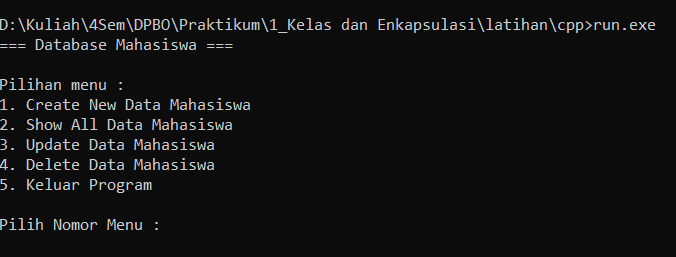
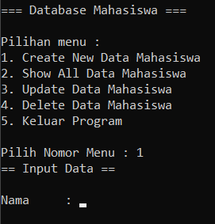
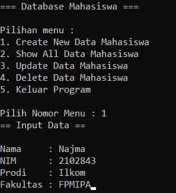
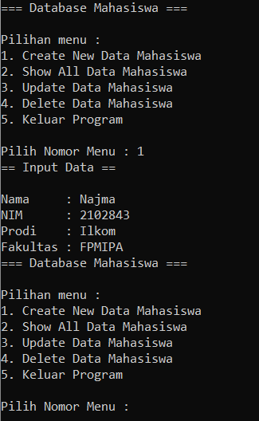
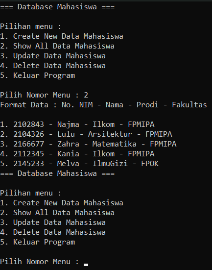
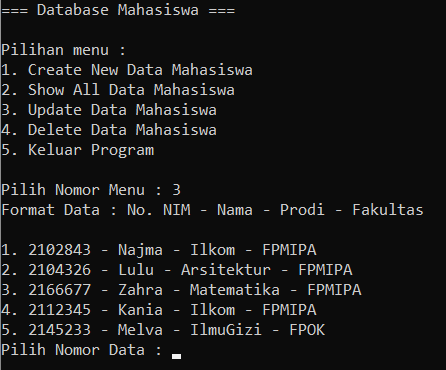
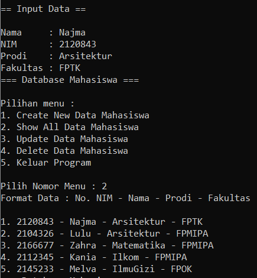
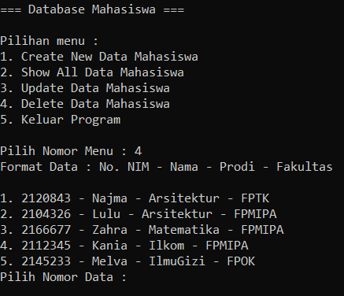
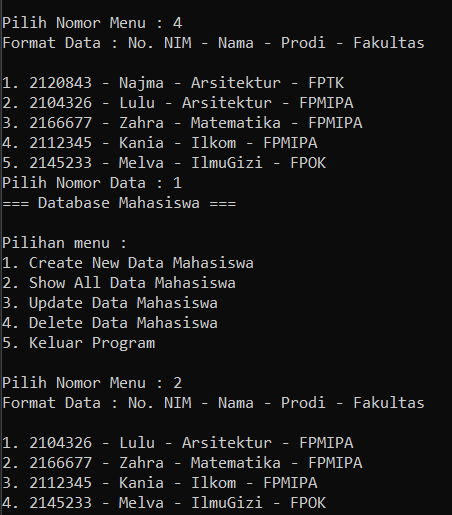

# LATIHAN1DPBO2023

Saya Najma Qalbi Dwiharani dengan NIM 2102843 mengerjakan soal Latihan 1 dalam mata kuliah Desain dan Pemrograman Berorientasi Objek untuk keberkahanNya maka saya tidak melakukan kecurangan seperti yang telah dispesifikasikan.
Aamiin.

## Desain Program

Program ini terdiri dari dua kelas dan satu kelas/program main, yaitu:

#### 1. Kelas Mahasiswa
Kelas ini memiliki atribut :
- Nama
- NIM
- Prodi
- Fakultas

Method yang ada pada kelas ini merupakan setter dan getter untuk tiap atribut, serta constructor dan destructor kelas tersebut.

#### 2. Kelas Database
Kelas ini tidak memiliki atribut, dan digunakan untuk melakukan operasi (seperti menambah, mengubah, dan menghapus data) terhadap objek yang kelasnya dalah mahasiswa dengan menggunakan setter dan getter dari kelas mahasiswa itu sendiri.

Method yang dimiliki kelas ini :
- createMhs : untuk menginstansiasi objek baru dari kelas mahasiswa
- readAllMhs : untuk menampilkan semua data dari list mahasiswa
- updateMhs : untuk memperbarui data pada objek mahasiswa yang telah ada (tidak ada di PHP)
- deleteMhs : menghapus satu data/objek mahasiswa dari list (tidak ada di PHP)

## Penjelasan Alur dan Dokumentasi

> Alur ini hanya untuk program pada bahasa c++, java, dan python

1. Program akan menampilkan menu berisi fitur yang dapat dilakukan, kemudian user akan diminta untuk memasukkan nomor menu yang diinginkan
   

> catatan : program ini belum memiliki error handling sehingga semua aktivitas user dianggap ideal. Seperti jika menginputkan nomor menu yang tidak tersedia, atau memilih menu Show All ketika belum ada data sama sekali.

- Create New Data Mahasiswa
  Setelah memilih fitur ini, user akan diminta untuk memasukkan data-data mahasiswa.
  
  
  
  
  Kemudian akan dikembalikan lagi ke menu awal.
  
  
  
- Show All Data Mahasiswa
  Setelah memilih fitur ini, program akan menampilkan list seluruh data mahasiswa yang telah dimasukkan sebelumnya, dan akan ditampilkan menu.
  
  
  
- Update Data Mahasiswa
  Setelah memilih fitur ini, program akan menampilkan list seluruh data mahasiswa yang telah dimasukkan sebelumnya. Kemudian user diminta untuk memasukkan nomor data yang ingin diubah dari list tersebut.
  
  
  
  Setelah itu, user diminta untuk memperbarui data-data mahasiswa yang sebelumnya dipilih.
  
  
  
  Kemudian akan dikembalikan lagi ke menu awal. Jika dilihat dengan show all data mahasiswa tersebut telah berubah.
  
  
  
- Delete Data Mahasiswa
- 
  
  
  Setelah memilih fitur ini, program akan menampilkan list seluruh data mahasiswa yang telah dimasukkan sebelumnya. Kemudian user diminta untuk memasukkan nomor data yang ingin diubah dari list tersebut.
  
  
  
  Kemudian akan dikembalikan lagi ke menu awal. Jika dilihat dengan show all data mahasiswa tersebut tidak ada.
  
